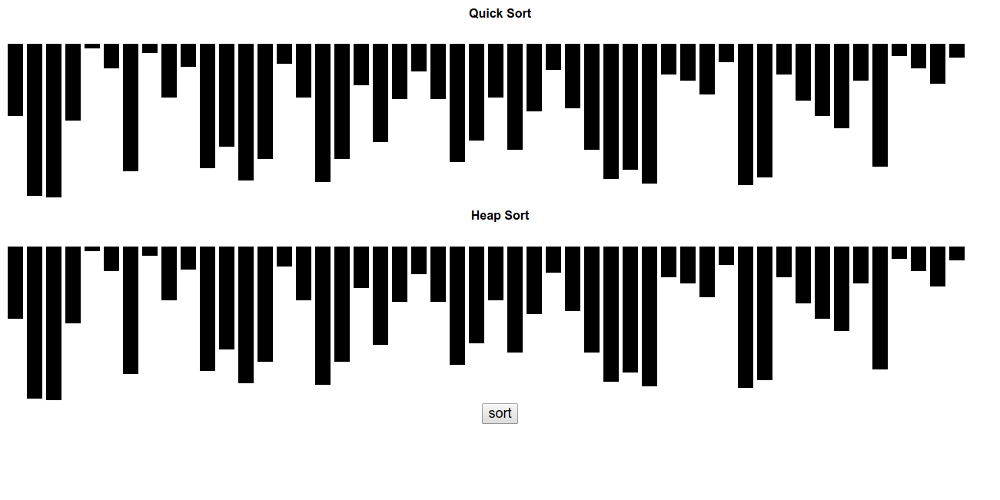
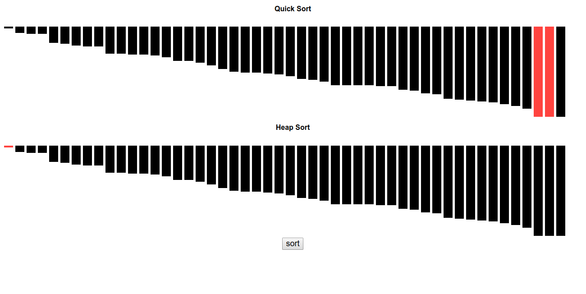

This project animates two sorting algorithms: quickSort and heapSort using rectangles. 

Length of rectangles represents magnitude of the corresponding number in array of 50 numbers.

Highlighted(Red) parts means the two rectangles are swapped.

